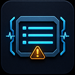

<!-- Copyright (c) 2026 haozena. All Rights Reserved. -->

# DebugLogLibrary



DebugLogLibrary is a runtime logging plugin for Unreal Engine. It provides Blueprint nodes and C++ helpers for writing formatted debug messages to the Output Log, the game viewport, and Unreal Engine's Visual Logger.

## Compatibility

| Item | Value |
| --- | --- |
| Plugin version | 5.8.1 |
| Unreal Engine | 5.8 |
| Platforms | No explicit platform allow list |
| Module type | Runtime |
| Loading phase | Earliest Possible |

The plugin descriptor currently targets Unreal Engine 5.8 explicitly. Rebuild the plugin from source before using it with another engine version.

## Features

- Blueprint-callable logging nodes in the `DebugLog` category.
- Output to the Output Log, viewport, both destinations, or neither.
- Information, warning, and error messages.
- Conditional information, warning, and error nodes.
- Logging for strings, string arrays, integers, floats, vectors, vector arrays, and rotators.
- Optional timestamps, prefixes, suffixes, object context, and Visual Logger output.
- Configurable on-screen duration, color, and message key.
- Helper nodes and C++ macros for marking unfinished functions and branches.
- Logging disabled in Shipping and Test builds by default.

## Installation

### Step 1: Get the Plugin from Fab

Both installation methods require you to acquire the plugin from Fab first. The Unreal Engine plugin download is handled through the Fab Library in the Epic Games Launcher.

1. Sign in to [Fab](https://www.fab.com/) with your Epic Games account.
2. Search for **DebugLogLibrary** and open its product page.
3. Select **Add to My Library** for a free listing, or complete the purchase for a paid listing.
4. Open the Epic Games Launcher and go to **Unreal Engine > Library > Fab Library**. Refresh the Fab Library if the plugin does not appear immediately.

After the plugin appears in your Fab Library, choose one of the following installation methods.

### Method 1: Install to the Engine (Recommended)

This method makes the plugin available to every project that uses the selected Unreal Engine installation.

1. Find **DebugLogLibrary** in the Epic Games Launcher's **Fab Library**.
2. Click **Install to Engine**.
3. Select a supported Unreal Engine version, then click **Install**. This release targets Unreal Engine 5.8.
4. Open your project with that engine version.
5. If necessary, enable **DebugLogLibrary** under **Edit > Plugins**, then restart the editor when prompted.

### Method 2: Install to a Single Project

Use a project-level installation when the plugin must travel with source control, remain isolated to one project, or be modified locally.

1. Obtain the plugin package through Fab as described above. If Fab installs the plugin to the engine first, locate the installed `DebugLogLibrary` folder under that engine's `Engine/Plugins` directory.
2. Close Unreal Editor.
3. Copy the complete `DebugLogLibrary` folder into your project's `Plugins` directory:

   ```text
   YourProject/
   `-- Plugins/
       `-- DebugLogLibrary/
           |-- DebugLogLibrary.uplugin
           |-- Resources/
           `-- Source/
   ```

4. Confirm that `YourProject/Plugins/DebugLogLibrary/DebugLogLibrary.uplugin` exists.
5. Open the project. If Unreal Engine requests a module rebuild, build the project for the target engine and platform.
6. If necessary, enable **DebugLogLibrary** under **Edit > Plugins**, then restart the editor when prompted.

Use only one copy of the plugin for a given project. Remove or disable a duplicate project-level copy if the same plugin is already being loaded from the engine installation.

For the official Fab plugin workflow, see [Working with Plugins in Unreal Engine](https://dev.epicgames.com/documentation/en-us/unreal-engine/working-with-plugins-in-unreal-engine).

For C++ projects, add the module to the appropriate dependency list in your project's `.Build.cs` file:

```csharp
PrivateDependencyModuleNames.AddRange(
    new string[]
    {
        "DebugLogLibrary"
    }
);
```

## Blueprint Quick Start

In a Blueprint graph, search for `DebugLog`. Add a node such as **Print Info**, enter a message, and select an output destination.

Most nodes expose the following common inputs:

| Input | Description |
| --- | --- |
| `Prefix` | Text inserted before the formatted message. |
| `Suffix` | Text appended after the formatted message. |
| `Logging Option` | Selects the viewport, Output Log, both, or disabled output. |
| `VLog` | Also writes the message to the Visual Logger when enabled. |
| `Settings` | Controls timestamp, compact formatting, viewport duration, key, and color. |
| `Context Object` | Optional object used to identify the source and provide Visual Logger context. This pin defaults to `Self` and is hidden on the node. |

Advanced inputs are collapsed by default on most Blueprint nodes.

## Output Destinations

The `ELoggingOptions` enum provides four modes:

| Value | Blueprint name | Behavior |
| --- | --- | --- |
| `LO_Viewport` | Viewport | Displays the message on screen. |
| `LO_Console` | Console | Writes the message to the Unreal Output Log. |
| `LO_Both` | Viewport and Console | Writes to both destinations. |
| `LO_NoLog` | Disabled | Suppresses the message. |

## Log Settings

`FDebugLogSettings` is available to Blueprints and C++. Its current defaults are:

| Setting | Default | Description |
| --- | --- | --- |
| `IsLogDateTime` | `true` | Prepends the current local date and time. |
| `bCompact` | `false` | Uses compact formatting for supported vector values. |
| `TimeToDisplay` | `5.0` seconds | Controls how long viewport messages remain visible. |
| `Key` | `-1` | Adds a new on-screen message instead of replacing an existing keyed message. |
| `TextColor` | `(0.0, 0.66, 1.0)` | Sets the viewport message color. |

The formatted output includes the optional context object name, prefix, message, and suffix. Array nodes label each entry with its array index.

## Blueprint Node Reference

### General Messages

| Node | Description |
| --- | --- |
| `PrintString` | Logs a string as an information message. |
| `PrintStringArray` | Logs every string in an array with its index. |
| `PrintInfo` | Logs an informational message. |
| `PrintInfo(Condition)` | Logs an informational message only when the condition is true. |
| `PrintWarning` | Logs a warning message. |
| `PrintWarning(Condition)` | Logs a warning only when the condition is true. |
| `PrintError` | Logs an error message. |
| `PrintError(Condition)` | Logs an error only when the condition is true. |

### Structured Values

| Node | Description |
| --- | --- |
| `PrintVector` | Logs an `FVector`; supports compact formatting. |
| `PrintVector2D` | Logs an `FVector2D`; supports compact formatting. |
| `PrintArrayVector` | Logs an indexed array of `FVector` values. |
| `PrintArrayVector2D` | Logs an indexed array of `FVector2D` values. |
| `PrintRotator` | Logs selected roll, pitch, and yaw components. |
| `PrintNumberInt` | Logs an integer using the selected number-system option. |
| `PrintArrayFloat` | Logs an indexed array of floating-point values. |

### Development Helpers

| Node | Description |
| --- | --- |
| `PrintBranchToBeImplemented` | Logs a warning identifying an unfinished function branch. |
| `PrintFunctionToBeImplemented` | Logs a warning identifying an unimplemented function. |
| `PrintFunctionISIncomplete` | Logs a warning identifying an incomplete function. |
| `PrintVLog` | Writes directly to the Visual Logger using the selected severity. |

## Visual Logger

Set `VLog` to `true` on the standard logging nodes to mirror their messages to Unreal Engine's Visual Logger. Suppressed messages using `LO_NoLog` are not mirrored.

`PrintVLog` writes directly to the Visual Logger and supports these severities through `EDebugLogType`:

- Info
- Success
- Warning
- Error
- Fatal

Provide a valid context object when you want the Visual Logger entry associated with a specific actor or UObject.

## C++ Usage

Include the Blueprint function library header:

```cpp
#include "DebugLogLibraryBPLibrary.h"
```

Write a message to the Output Log and viewport:

```cpp
ULog::PrintInfo(
    TEXT("Inventory initialized"),
    TEXT("[Inventory] "),
    TEXT(""),
    LO_Both
);
```

Customize the on-screen message:

```cpp
FDebugLogSettings Settings;
Settings.IsLogDateTime = true;
Settings.TimeToDisplay = 8.0f;
Settings.Key = 100;
Settings.TextColor = FLinearColor::Yellow;

ULog::PrintWarning(
    TEXT("Item data is incomplete"),
    TEXT("[Inventory] "),
    TEXT(""),
    LO_Both,
    false,
    Settings,
    this
);
```

Conditional nodes are also available from C++:

```cpp
ULog::PrintError_WithCondition(
    TEXT("Actor reference is invalid"),
    TargetActor == nullptr,
    TEXT("[Validation] "),
    TEXT(""),
    LO_Console
);
```

## C++ Macros

The public header provides source-location and convenience macros.

### Source Information

```cpp
ULOG_GET_CUR_FUNC_NAME()
ULOG_GET_CUR_FILE()
ULOG_GET_CUR_LINE()
ULOG_GET_CODE_INFO()
ULOG_GET_CODE_INFO_WITH_PREFIX()
```

### Implementation Markers

```cpp
ULOG_FUNC_TOBEIMPLEMENTED()
ULOG_BRANCH_TOBEIMPLEMENTED(TEXT("Server path"))
ULOG_FUNC_ISINCOMPLETE()
```

Equivalent `ULOG_PRINT_*` aliases are also provided.

### Object-Aware Message Macros

These macros prepend the current UObject name and are intended for use in classes where `GetName()` is available:

```cpp
ULOG_PRINT_INFO(TEXT("Ready"));
ULOG_PRINT_INFO_BOTH(TEXT("Ready"));
ULOG_PRINT_INFO_VIEWPORT(TEXT("Ready"));

ULOG_PRINT_WARNING(TEXT("Using fallback data"));
ULOG_PRINT_WARNING_BOTH(TEXT("Using fallback data"));
ULOG_PRINT_WARNING_VIEWPORT(TEXT("Using fallback data"));

ULOG_PRINT_ERROR(TEXT("Operation failed"));
ULOG_PRINT_ERROR_BOTH(TEXT("Operation failed"));
ULOG_PRINT_ERROR_VIEWPORT(TEXT("Operation failed"));
```

## Build Configuration

Debug logging is enabled when either of these conditions is true:

- The target is not a Shipping or Test build.
- `USE_LOGGING_IN_SHIPPING` is explicitly defined as `1` for the module build.

By default, the plugin defines `USE_LOGGING_IN_SHIPPING` as `0`, so its logging functions do nothing in Shipping and Test builds. The Blueprint functions are also marked `DevelopmentOnly`.

## Current Implementation Notes

- Decimal, binary, hexadecimal, and octal integer output is implemented. Hexadecimal output uses uppercase digits without a prefix; binary and octal output also omit prefixes. Negative values retain a leading minus sign.
- Roman-numeral conversion uses standard notation for values from 1 through 3999. Zero, negative values, and values above 3999 fall back to decimal text instead of returning an empty string.
- `PrintVLog` always targets the Visual Logger. Its `VLog` and `Settings` inputs are retained for API consistency but are not currently used by that function.

## Support

- Documentation: https://github.com/givecode/DebugLogLibrary
- Report issues or request new features: https://github.com/givecode/DebugLogLibrary/issues

## Copyright

Copyright (c) 2026 haozena. All Rights Reserved.
